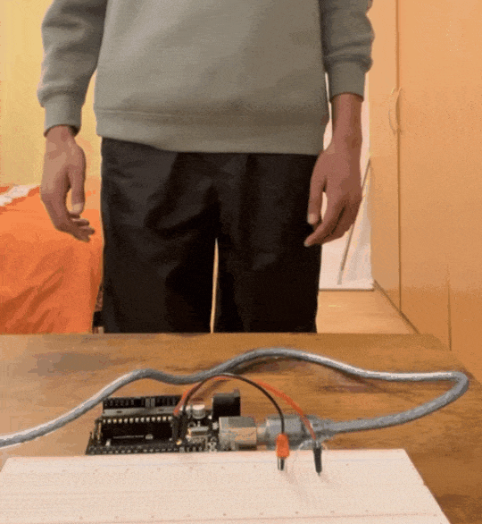
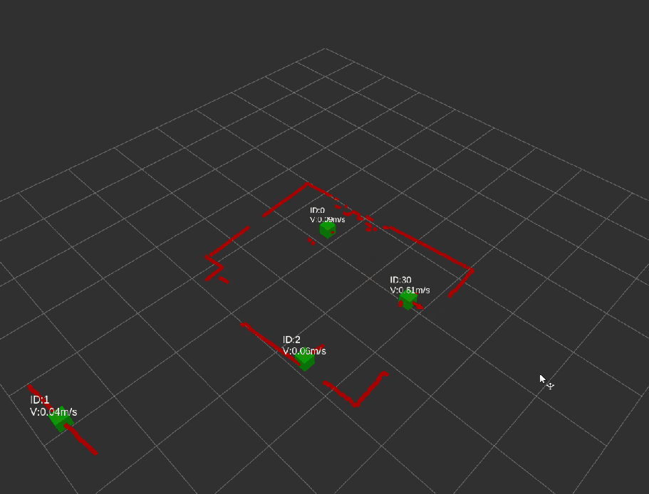
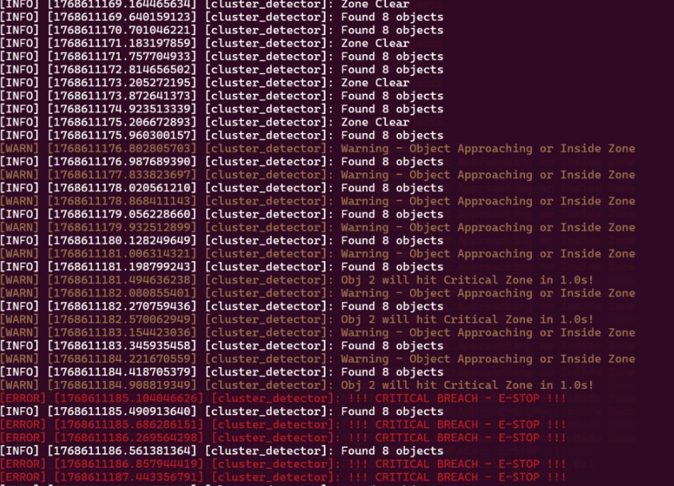

# Velocity-Aware Safety Monitoring System

**Real-time multi-object tracking with predictive collision warnings and hardware integration**



---

## Overview

A LIDAR-based safety system that tracks multiple objects simultaneously and provides predictive collision warnings based on approach velocity. I built it to demonstrate perception algorithms, embedded integration, and real-time control systems.

**Key Feature:** Multi-object tracking with DBSCAN clustering, real-time velocity calculation, and hardware-enforced safety zones with predictive collision warnings.

---

## Demo

### Live System Operation


*System responding to approach: LED turns off when critical zone is breached*

### Multi-Object Tracking Visualization


*Real-time LIDAR clustering showing tracked objects with velocity calculations*

### System Logs


*Object detection and zone monitoring in real-time*

### Full System Demonstration
[  
*Click to watch: Complete hardware setup and live operation*

---

## Features

**Multi-Object Tracking**
- DBSCAN clustering converts LIDAR scans into distinct objects
- Tracks multiple simultaneous objects with IDs showing
- Nearest-neighbor frame-to-frame association

**Velocity-Based Tracking**
- Real-time velocity calculation from position deltas
- Time-to-collision predictions: "Will hit Critical Zone in 1.0s!"

**Hardware Integration**
- ROS 2 ↔ Arduino serial communication
- LED state responds to safety zones (ON = safe, OFF = breach)
- Response latency: <150ms from detection to hardware trigger

**Safety Zones**
- Warning Zone: Predictive alerts based on object velocity
- Critical Zone: Hardware-enforced boundary at 0.9m

---

## Technical Stack

**Software:**
- ROS 2 Humble (Ubuntu 22.04 via WSL2)
- Python 3.10 with scikit-learn (DBSCAN)
- RViz2 for visualization

**Hardware:**
- Slamtec RPLIDAR C1 (2D 360° laser scanner)
- Arduino Mega 2560
- LED indicators

---

## Performance

**What worked well:**
- DBSCAN with `eps=0.3, min_samples=10` gave stable clustering
- Moving average filter eliminated velocity noise
- System handles multiple objects reliably

**Limitations:**
- Tracking breaks when objects cross paths
- 2D LIDAR only—objects must be in scan plane
- Critical zone is static (future: dynamic ISO 13855 implementation)

---

## Quick Start

### Prerequisites
```bash
# ROS 2 Humble
sudo apt install ros-humble-desktop

# Python dependencies
pip install scikit-learn numpy
```

### Running

**Terminal 1: LIDAR**
```bash
ros2 launch sllidar_ros2 view_sllidar_c1_launch.py
```

**Terminal 2: Safety Monitor**
```bash
ros2 run scanner_core cluster_detector
```

**Terminal 3: Visualization**
```bash
rviz2
# Add LaserScan (/scan) and MarkerArray (/safety_scanner/objects)
```

---

## What I Learned

**Technical:**
- DBSCAN parameter tuning is critical for stable clustering
- Serial communication latency matters—optimized message frequency to reduce lag
- Frame-to-frame tracking needs filtering or velocity estimates are too noisy

**Engineering:**
- Build incrementally—got basic visualization working before adding complexity
- Test failure modes early—discovered tracking issues with crossing objects on Day 4
- Hardware integration is where projects break—integrated Arduino early to debug issues

---
